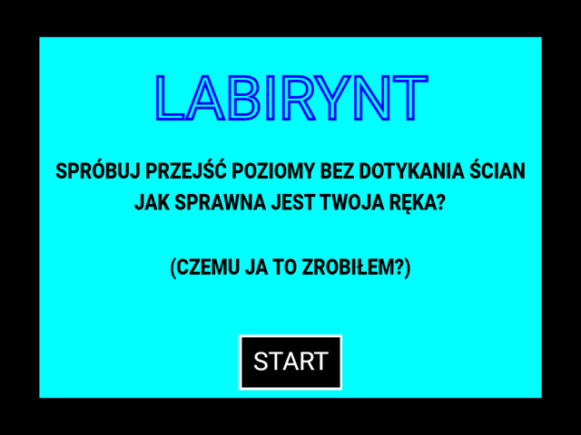
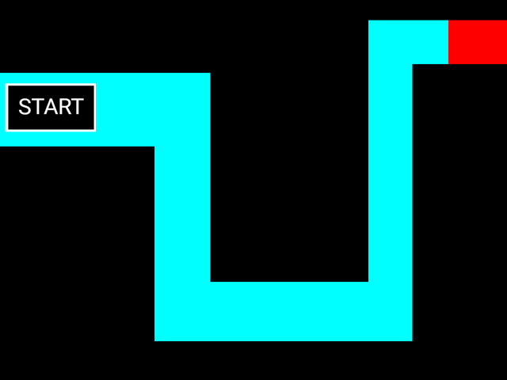

# Szkoła - Labirynt

Prosta gra zrobiona jako projekt na lekcje, wzorowana na [internetowym klasyku](https://screamer.wiki/The_Maze) 🦭

## Zrzuty ekranu





## Użyte biblioteki
- [SFML](https://www.sfml-dev.org/) (branch 2.6.x)

## Jak skompilować?

Upewnij się, że masz zainstalowane [CMake](https://cmake.org/), [Git](https://git-scm.com/) oraz kompilator C++.

> **Uwaga:** Zalecam otworzyć projekt w [Visual Studio Code](https://code.visualstudio.com/) razem z zaproponowanymi rozszerzeniami.

Sklonuj repozytorium
```bash
git clone https://github.com/Jewar-PL/Szkola-Labirynt.git
```

Wejdź do folderu
```bash
cd Szkola-Labirynt
```

Skompiluj aplikację z pomocą CMake
```bash
cmake -S . -B build
cmake --build build
```

Uruchom aplikację
```bash
./build/game
```

## Uwagi

**Ta gra została stworzona jako projekt szkolny, więc jakość kodu mogła być dużo lepsza, ale robiłem to na czas i z pewnymi ograniczeniami.**

**Pozdrawiam profil Technik Programista 🦭**
